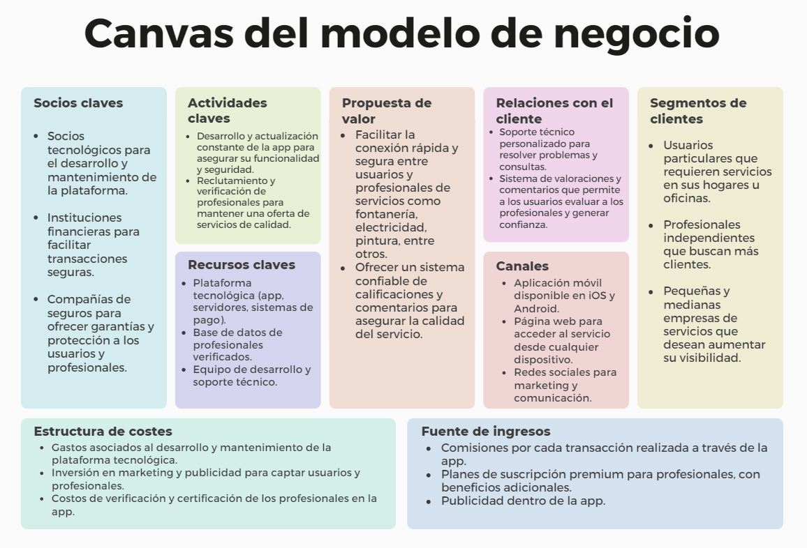

# 1.2. Modelo de Negocio

El modelo de negocio se basa en las siguientes características:

1. **Segmento de clientes**

   - **Usuarios particulares**: Que requieren servicios en sus hogares u oficinas.
   - **Profesionales independientes**: Que buscan aumentar su cartera de clientes.
   - **Pequeñas y medianas empresas de servicios**: Que desean aumentar su visibilidad y captar más clientes.

2. **Propuesta de valor**

   - **Conexión rápida y segura**: Facilita la conexión ágil entre usuarios y profesionales de servicios como fontanería, electricidad, pintura, entre otros.
   - **Sistema confiable de calificaciones**: Ofrece un sistema de calificaciones y comentarios para asegurar la calidad del servicio y generar confianza en los usuarios.

3. **Canales**

   - **Página web**: Permite el acceso desde cualquier dispositivo.
   - **Redes sociales**: Utilizadas para marketing y comunicación con usuarios y profesionales.

4. **Relaciones con los clientes**

   - **Soporte técnico personalizado**: Disponible para resolver problemas y consultas de usuarios.
   - **Sistema de valoraciones**: Los usuarios pueden evaluar a los profesionales, generando transparencia y confianza.

5. **Fuentes de ingresos**

   - **Comisiones por transacción**: Se cobra una comisión por cada transacción realizada a través de la app.
   - **Planes de suscripción premium**: Los profesionales pueden acceder a beneficios adicionales mediante planes de suscripción.
   - **Publicidad dentro de la app**: Espacios publicitarios disponibles para aumentar los ingresos.

6. **Recursos clave**

   - **Plataforma tecnológica**: Incluye la app, servidores y sistemas de pago.
   - **Base de datos de profesionales**: Verificados y confiables.
   - **Equipo de desarrollo y soporte técnico**: Encargado de asegurar el buen funcionamiento de la plataforma.

7. **Actividades clave**

   - **Desarrollo y actualización constante**: Para asegurar la funcionalidad y seguridad de la plataforma.
   - **Reclutamiento y verificación de profesionales**: Para mantener una oferta de servicios de calidad.

8. **Socios clave**

   - **Socios tecnológicos**: Encargados del desarrollo y mantenimiento de la plataforma.
   - **Instituciones financieras**: Que facilitan transacciones seguras.
   - **Compañías de seguros**: Que ofrecen garantías y protección tanto para usuarios como para profesionales.

9. **Estructura de costos**

   - **Desarrollo y mantenimiento**: Costos asociados al desarrollo y mantenimiento de la plataforma tecnológica.
   - **Marketing y publicidad**: Inversión en marketing para captar usuarios y profesionales.
   - **Verificación de profesionales**: Gastos de verificación y certificación para asegurar la calidad del servicio.

[1. Caso de Negocio](../1.md)

[Regresar al índice](../../README.md)
