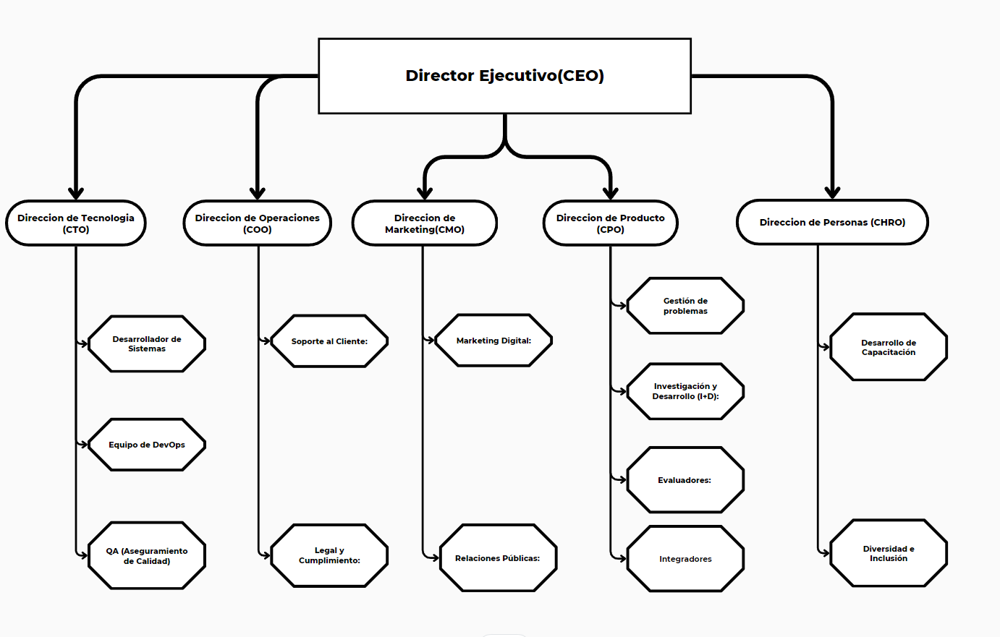

# 1.3. Estructura del Equipo

Nuestro equipo en InStudio está compuesto por expertos con experiencia en tecnología, belleza y gestión empresarial:

- **CEO (Abraham Bustios)**: Lidera la visión estratégica y el crecimiento general de A tu Puerta.
- **CTO (Aaron Livias)**: Supervisa el desarrollo y mantenimiento de la plataforma digital.
- **CPO (Alejandro Gomez)**: Supervisa el desarrollo y evolución de los productos de la empresa.
- **COO (Andre Lopez )**: Gestiona las operaciones diarias y establece alianzas estratégicas con salones de belleza.
- **CMO(Mario)**: Encargado de las estrategias de promoción y publicidad para atraer y retener usuarios.
- **CHRO(George Zuñiga)**: Responsable principal de gestionar todos los aspectos relacionados con los recursos humanos en la organización. 

**Director Ejecutivo (CEO)**
Es el encargado de la visión y dirección estratégica de la empresa. Toma las decisiones más importantes sobre el rumbo del negocio, asegurándose de que la plataforma crezca y sea sostenible a largo plazo.

----------------------------------------------------------------
**Dirección de Tecnología (CTO) :**
Supervisa todo lo relacionado con la tecnología, incluyendo el desarrollo y mantenimiento de la aplicación web. Su responsabilidad es que la plataforma funcione correctamente y pueda escalar según aumente el número de usuarios.

Desarrollador de Sistemas:Encargados de crear la web completa utilizando los requerimientos con los cuales se planificaron.

Equipo de DevOps: Se encargan de la infraestructura en la nube, facilitando el despliegue continuo de actualizaciones y el buen funcionamiento de la plataforma.

QA (Aseguramiento de Calidad): Realizan pruebas antes de cualquier lanzamiento para garantizar que la aplicación funciona sin errores.

-----------------------------------------------------------------
**Dirección de Operaciones (COO) :**
Responsable de la optimización de operaciones y la eficiencia general.

Soporte al Cliente: Ayuda a los usuarios y profesionales con dudas o problemas que puedan tener al usar la plataforma.

Legal y Cumplimiento: Asegura que la empresa cumple con las normativas legales, como la protección de datos y las regulaciones de cada país.

-------------------------------------------------------------------
**Dirección de Marketing (CMO) :**
Gestiona la estrategia de marketing y la promoción de la marca.

Marketing Digital: Se enfoca en adquirir nuevos usuarios y profesionales mediante campañas en redes sociales, publicidad en línea, y estrategias SEO.

Relaciones Públicas: Trabajan en la reputación de la empresa y mantienen relaciones con medios y actores clave.

-------------------------------------------------------------------
**Dirección de Producto (CPO) :**
Supervisa el desarrollo y evolución de los productos de la empresa.

Gestión de Problemas: Encargado de dar soporte a los problemas que se archivaron en separado a los problemas comunes .

Investigación y Desarrollo (I+D): Busca innovaciones tecnológicas para mejorar la plataforma y ofrece nuevas soluciones para los usuarios.

Evaluadores: Monitorean la calidad de los profesionales registrados en la plataforma para asegurar que mantienen un nivel de servicio adecuado.

Integradores: Gestionan la integración de servicios de terceros, como plataformas de pago o tecnologías adicionales.

--------------------------------------------------------------------
**Dirección de Personas (CHRO) :**
Se encarga de contratar, entrenar y retener al personal. Además, fomenta una cultura organizacional positiva que atraiga y mantenga talento.

Diversidad e Inclusión: Asegura que la empresa tenga un equipo diverso y que las políticas promuevan un entorno laboral equitativo.

---------------------------------------------------------------------
[1. Caso de Negocio](../1.md)

[Regresar al índice](../../README.md)
