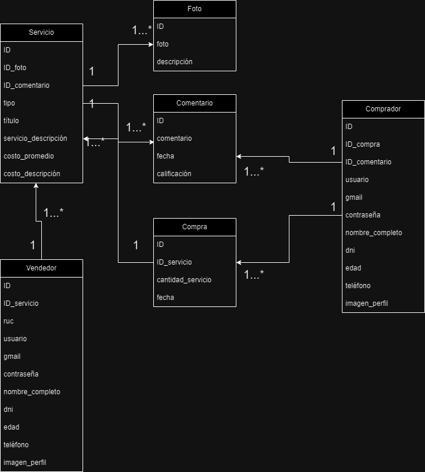

# 3.3. Modelo de Datos

#### El modelo de datos que elegimos para el proyecto es el modelo "relacional", puesto que los tipos de datos que maneja el sistema se encuentrarn relacionados unos con otros  mediante primarys y foreign keys a traves de las multiples tablas.

[3 Decisiones a Nivel de Arquitectura](../3.md)

[Regresar al índice](../../README.md)
