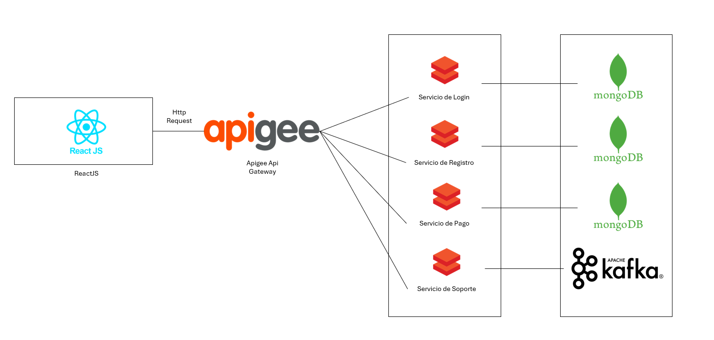

# 3.4. Mapeo entre elementos de Arquitectura

Este diagrama representa la conexión entre los elementos de la plataforma, utilizando diversas tecnologías para garantizar la correcta gestión de los módulos y la escalabilidad del sistema.

## Componentes

### 1. Frontend - ReactJS
El cliente web está desarrollado en **ReactJS**, desde donde los usuarios realizan solicitudes HTTP para interactuar con los servicios de la plataforma.

### 2. API Gateway - Apigee
La plataforma utiliza **Apigee** como puerta de enlace API, que se encarga de:
- Recibir y gestionar las solicitudes HTTP provenientes de ReactJS.
- Rutar las solicitudes a los microservicios correspondientes.
- Proveer gestión, seguridad y monitoreo de las APIs.

### 3. Microservicios
La arquitectura está basada en microservicios especializados:
- **Servicio de Login**: Gestiona la autenticación de los usuarios (validación de credenciales y emisión de tokens).
- **Servicio de Registro**: Maneja el registro de usuarios y el almacenamiento de información personal.
- **Servicio de Pago**: Procesa los pagos realizados por los usuarios para el alquiler de servicios.
- **Servicio de Soporte**: Brinda asistencia y permite a los usuarios reportar problemas o hacer consultas.

### 4. Bases de Datos - MongoDB
Cada microservicio utiliza **MongoDB** como sistema de base de datos NoSQL para almacenar la información relacionada:
- Usuarios.
- Pagos.
- Datos de soporte y asistencia.

### 5. Apache Kafka
La plataforma incorpora **Apache Kafka** para:
- Gestionar la mensajería en tiempo real entre los microservicios.
- Facilitar la integración asincrónica y la escalabilidad del sistema.

[3 Decisiones a Nivel de Arquitectura](../3.md)

[Regresar al índice](../../README.md)
