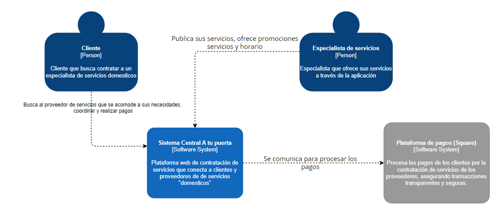

# 5.1. Contexto

**Descripción:** Plataforma web de contratación de servicios que conecta a clientes y proveedores de de servicios "domesticos"

### Usuarios y Sistemas Externos:

- **Clientes (Usuarios)**
  - **Interacción:** Utilizan la plataforma para buscar proveedores de servicios , ver negocios  y realizar pagos en línea.

- **Especialistas técnicos / negocios  (Proveedores)**
  - **Interacción:** Ofrecen sus servicios , negocian con el cliente

- **Pasarela de Pago (Stripe)**
  - **Interacción:** Procesa los pagos de los clientes para las reservas, asegurando transacciones seguras y eficientes.
 

### Imagen

