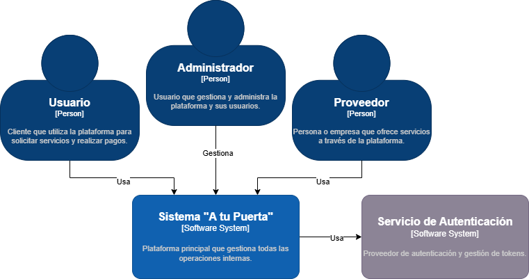

# 9.2. Iteración 1: Definir la estructura general del sistema

### Paso 1: Revisar Entradas

| **Propósito de Diseño**     | **Funcionalidad Primaria**     | **Escenarios de Calidad**       | **Restricciones y Preocupaciones de Arquitectura**      |
|-----------------------------|--------------------------------|--------------------------------|--------------------------------------------------------|
| Definir una arquitectura base que permita soportar la gestión de usuarios, servicios, pagos y comunicación en la plataforma de manera escalable y segura. | - Implementar el registro e inicio de sesión (UC-01).  - Gestión de datos de perfil (UC-02).  - Búsqueda y filtrado de servicios (UC-03). | - El sistema debe asegurar el acceso seguro solo para usuarios autenticados (QA-01).  - La plataforma debe responder de forma rápida al filtrar servicios (QA-03).  - El sistema debe estar disponible sin interrupciones durante el registro y autenticación (QA-02). | - Uso de Next.js y Node.js como tecnologías principales para frontend y backend respectivamente (CON-02).  - Base de datos MongoDB con conexión optimizada (CON-03).  - Modularidad y escalabilidad para soportar futuros aumentos en la carga de usuarios (CRN-01).  - Seguridad de la información personal con encriptación mediante bcryptjs y JWT (CRN-02). |

---

### Paso 2: Establecer objetivo de la iteración

En esta primera iteración, el enfoque es establecer la estructura fundamental del sistema que servirá como base para las siguientes fases de desarrollo. La idea es garantizar que el sistema sea modular, escalable y seguro para soportar funcionalidades críticas desde el inicio.

### Paso 3: Eleccion de elementos del sistema a refinar

#### Diagrama de contexto

### Paso 4: Eleccion de conceptos de diseño que satisfacen el driver seleccionado

| **Código** | **Decisión de Diseño**                                      | **Fundamentación**                                                                                      |
|------------|-------------------------------------------------------------|--------------------------------------------------------------------------------------------------------|
| DEC-1      | Utilizar una arquitectura en 3 capas (frontend, backend, base de datos). | Esta arquitectura separa la presentación, la lógica de negocio y los datos, lo que mejora la mantenibilidad y escalabilidad (CRN-01). Ideal para gestionar la modularidad requerida en el proyecto. |
| DEC-2      | Implementar un sistema de autenticación centralizado con JSON Web Tokens (JWT). | Esta solución asegura que solo usuarios autenticados puedan acceder a los recursos protegidos, cumpliendo con los requisitos de seguridad (QA-01). Además, es una tecnología que el equipo ya domina (CON-02). |
| DEC-3      | Usar Next.js para el frontend y Node.js con Express para el backend. | Aprovecha la experiencia del equipo, lo que facilita un desarrollo ágil y eficiente. Soporta la modularidad y la escalabilidad necesarias (CON-02, CRN-03). |
| DEC-4      | Utilizar MongoDB para la base de datos, con un enfoque NoSQL. | MongoDB es altamente escalable y flexible, adecuado para manejar la naturaleza dinámica de los datos de usuarios y servicios (CON-03). Permite escalar horizontalmente para soportar el crecimiento futuro. |

---

### Paso 5: Instanciar elementos de arquitectura, asignar responsabilidades y definir interfaces

### Paso 6: Bosquejar vistas y registrar decisiones de diseño

### Paso 7: Revision de objetivos

