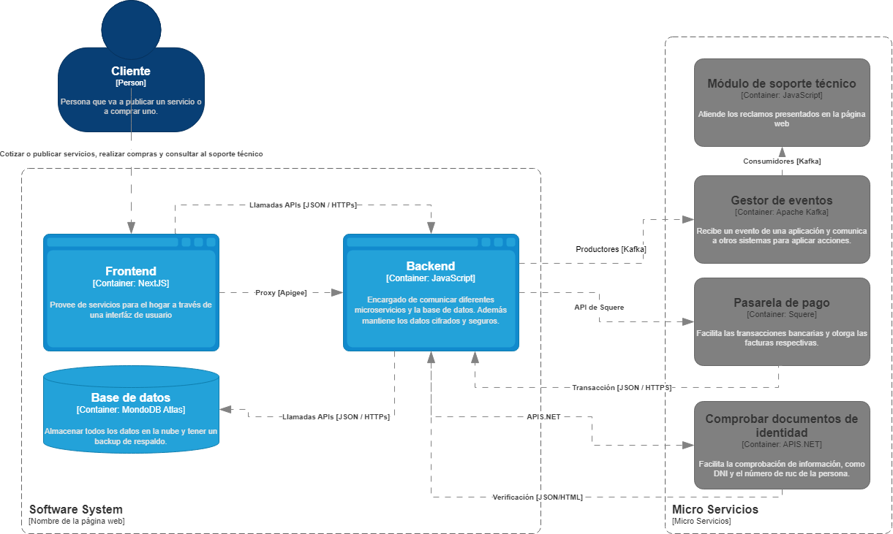

# 9.2. Iteración 1: Definir la estructura general del sistema

### Paso 1: Revisar Entradas

| **Propósito de Diseño**     | **Funcionalidad Primaria**     | **Escenarios de Calidad**       | **Restricciones y Preocupaciones de Arquitectura**      |
|-----------------------------|--------------------------------|--------------------------------|--------------------------------------------------------|
| Definir una arquitectura base que permita soportar la gestión de usuarios, servicios, pagos y comunicación en la plataforma de manera escalable y segura. | - Implementar el registro e inicio de sesión (UC-01).  - Gestión de datos de perfil (UC-02).  - Búsqueda y filtrado de servicios (UC-03). | - El sistema debe asegurar el acceso seguro solo para usuarios autenticados (QA-01).  - La plataforma debe responder de forma rápida al filtrar servicios (QA-03).  - El sistema debe estar disponible sin interrupciones durante el registro y autenticación (QA-02). | - Uso de Next.js y Node.js como tecnologías principales para frontend y backend respectivamente (CON-02).  - Base de datos MongoDB con conexión optimizada (CON-03).  - Modularidad y escalabilidad para soportar futuros aumentos en la carga de usuarios (CRN-01).  - Seguridad de la información personal con encriptación mediante bcryptjs y JWT (CRN-02). |

---

### Paso 2: Establecer objetivo de la iteración

En esta primera iteración, el enfoque es establecer la estructura fundamental del sistema que servirá como base para las siguientes fases de desarrollo. La idea es garantizar que el sistema sea modular, escalable y seguro para soportar funcionalidades críticas desde el inicio.

### Paso 3: Eleccion de elementos del sistema a refinar

#### Diagrama de contexto

Comenzando con el diseño desde cero, se ha creado un Diagrama de Contexto utilizando el modelo C4 para la plataforma "A tu Puerta". Este diagrama ilustra cómo los principales actores (Usuarios, Proveedores, y Administradores) interactúan con el sistema central, el cual gestiona las funcionalidades clave como autenticación, búsqueda de servicios y gestión de perfiles.

### Paso 4: Eleccion de conceptos de diseño que satisfacen el driver seleccionado

| **Código** | **Decisión de Diseño**                                 | **Fundamentación**                                                                                   |
|------------|-------------------------------------------------------|-----------------------------------------------------------------------------------------------------|
| DEC-1      | Utilizar una arquitectura en 3 capas (frontend, backend, base de datos). | Esta arquitectura permite dividir el sistema en tres componentes principales: presentación, lógica de negocio y datos. Esto mejora significativamente la **mantenibilidad**, ya que cada capa puede ser actualizada de forma independiente. Además, facilita la **escalabilidad**, permitiendo que cada capa crezca según las necesidades específicas del sistema. Este enfoque también garantiza la separación de responsabilidades, lo que simplifica la resolución de problemas y aumenta la modularidad del proyecto (CRN-01). |
| DEC-2      | Implementar un sistema de autenticación centralizado con JSON Web Tokens (JWT). | La implementación de JWT asegura que solo los usuarios autenticados puedan acceder a los recursos protegidos, cumpliendo con estrictos requisitos de **seguridad** (QA-01). JWT es una solución moderna basada en estándares que permite autenticar y verificar usuarios de manera **eficiente** y **segura**, sin necesidad de almacenar sesiones en el servidor. Además, su naturaleza compacta facilita la integración con arquitecturas distribuidas y microservicios, asegurando **compatibilidad** y **escalabilidad** para futuros desarrollos. La elección de JWT también se fundamenta en la experiencia previa del equipo, lo que reduce los riesgos técnicos y acelera el desarrollo (CON-02). |

---

### Paso 5: Instanciar elementos de arquitectura, asignar responsabilidades y definir interfaces
| **Código** | **Decisión de Diseño**                                 | **Fundamentación**                                                                                   |
|------------|-------------------------------------------------------|-----------------------------------------------------------------------------------------------------|
| DEC-3      | Usar Next.js para el frontend y Node.js con Express para el backend. | Next.js permite la creación de interfaces de usuario **interactivas**, **dinámicas** y altamente optimizadas gracias a su soporte para renderizado del lado del servidor (SSR). Esto mejora la **experiencia del usuario** al reducir los tiempos de carga. Node.js con Express es una combinación robusta para manejar peticiones del backend, proporcionando **rápido procesamiento** y soporte para aplicaciones en tiempo real. Esta elección también considera la experiencia del equipo en ambas tecnologías, lo que asegura un desarrollo **ágil y eficiente**. La combinación soporta la modularidad necesaria para escalar el sistema a medida que el proyecto crece (CON-02, CRN-03). |
| DEC-4      | Utilizar MongoDB para la base de datos, con un enfoque NoSQL. | MongoDB es una base de datos NoSQL ideal para manejar datos **dinámicos** y **no estructurados**, como los relacionados con usuarios y servicios. Su esquema flexible permite adaptarse fácilmente a cambios en los requerimientos del sistema sin grandes modificaciones estructurales. MongoDB también soporta la **escalabilidad horizontal**, lo que lo hace adecuado para manejar grandes volúmenes de datos y crecimiento exponencial. Esta elección garantiza que los datos relacionados con servicios, usuarios y actividades puedan ser gestionados de manera eficiente y segura (CON-03). Además, la comunidad activa de MongoDB y su amplia compatibilidad con Node.js refuerzan su idoneidad para el proyecto. |

---

### Paso 6: Bosquejar vistas y registrar decisiones de diseño

### Paso 7: Revisión de Objetivos

| **Elemento** | **No abordado** | **Parcialmente Abordado** | **Completamente Abordado** | **Decisión de diseño**                   |
|--------------|------------------|---------------------------|----------------------------|------------------------------------------|
| UC-01        |                  |                           | ✔                          | DEC-1, DEC-2, DEC-3, DEC-4              |
| UC-02        |                  | ✔                         |                            | DEC-2, DEC-4                             |
| UC-03        |                  | ✔                         |                            | DEC-1, DEC-3, DEC-4                      |
| UC-04        | ✔                |                           |                            |                                          |
| UC-05        |                  | ✔                         |                            | DEC-3, DEC-4                             |
| UC-06        |                  | ✔                         |                            | DEC-3, DEC-4                             |
| UC-07        |                  | ✔                         |                            | DEC-2, DEC-4                             |
| UC-08        | ✔                |                           |                            |                                          |
| UC-09        | ✔                |                           |                            |                                          |
| UC-10        | ✔                |                           |                            |                                          |
| UC-11        |                  | ✔                         |                            | DEC-2, DEC-4                             |
| UC-12        | ✔                |                           |                            |                                          |
| UC-13        | ✔                |                           |                            |                                          |
| UC-14        | ✔                |                           |                            |                                          |
| QA-01        |                  | ✔                         |                            | DEC-2, DEC-4                             |
| QA-02        |                  | ✔                         |                            | DEC-2, DEC-3                             |
| QA-03        |                  | ✔                         |                            | DEC-1, DEC-3, DEC-4                      |
| QA-04        | ✔                |                           |                            |                                          |
| QA-05        |                  | ✔                         |                            | DEC-3, DEC-4                             |
| QA-06        |                  | ✔                         |                            | DEC-2, DEC-4                             |
| QA-07        | ✔                |                           |                            |                                          |
| QA-08        | ✔                |                           |                            |                                          |
| QA-09        | ✔                |                           |                            |                                          |
| QA-10        |                  |                           | ✔                          | DEC-2, DEC-4                             |
| QA-11        | ✔                |                           |                            |                                          |
| QA-12        | ✔                |                           |                            |                                          |
| QA-13        | ✔                |                           |                            |                                          |
| QA-14        | ✔                |                           |                            |                                          |
| CON-01       | ✔                |                           |                            |                                          |
| CON-02       |                  |                           | ✔                          | DEC-3, DEC-4                             |
| CON-03       |                  |                           | ✔                          | DEC-4                                    |
| CON-04       |                  | ✔                         |                            | DEC-2                                    |
| CON-05       |                  | ✔                         |                            | DEC-2, DEC-4                             |
| CON-06       | ✔                |                           |                            |                                          |
| CON-07       | ✔                |                           |                            |                                          |
| CON-08       | ✔                |                           |                            |                                          |
| CRN-01       |                  |                           | ✔                          | DEC-1, DEC-3                             |
| CRN-02       |                  | ✔                         |                            | DEC-2, DEC-4                             |
| CRN-03       |                  | ✔                         |                            | DEC-3, DEC-4                             |
| CRN-04       | ✔                |                           |                            |                                          |
| CRN-05       |                  | ✔                         |                            | DEC-3, DEC-4                             |
| CRN-06       | ✔                |                           |                            |                                          |
| CRN-07       |                  | ✔                         |                            | DEC-1, DEC-4                             |
| CRN-08       | ✔                |                           |                            |                                          |
