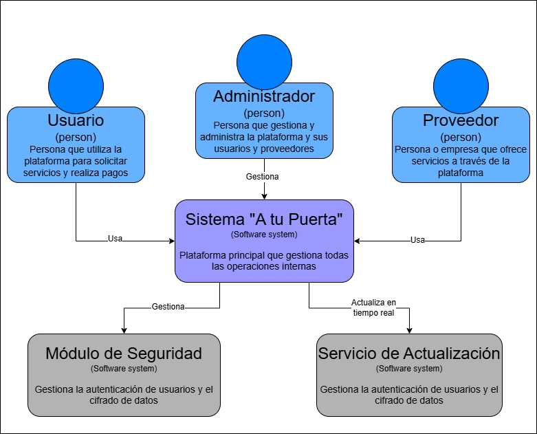

# 9.3. Iteración 2: Identificar estructuras para soportar la funcionalidad primaria

### Paso 1: Revisar Entradas
**Propósito de Diseño**  
Garantizar que el sistema soporte de manera eficiente la gestión de servicios y la actualización en tiempo real, cumpliendo con los casos de uso clave.

- **Funcionalidad Primaria:**
  - UC-04: Solicitud de servicios.
  - UC-05: Estado en tiempo real de solicitudes.
  - UC-06: Calificación del servicio.

- **Escenarios de Calidad:**
  - QA-06: Seguridad en la información de transacciones.
  - QA-04: Confiabilidad en la actualización en tiempo real del estado de solicitudes.

- **Restricciones y Preocupaciones de Arquitectura:**
  - Encriptación y protección de datos en tiempo real (CRN-02).
  - Cumplimiento de protocolos de seguridad en la integración de APIs externas (CON-08).

### Paso 2: Establecer objetivo de la iteración
Identificar las estructuras que soportarán la funcionalidad primaria, centrando el diseño en la gestión segura de servicios y la actualización en tiempo real.

### Paso 3: Elección de elementos del sistema a refinar

### Paso 4: Elección de conceptos de diseño que satisfacen el driver seleccionado
| Código | Decisión de Diseño                                              | Fundamentación                                                                                                 |
|--------|------------------------------------------------------------------|---------------------------------------------------------------------------------------------------------------|
| DEC-5  | Implementar actualización en tiempo real del estado de servicios.| Permite que los usuarios tengan información precisa sobre el estado de sus solicitudes en tiempo real (QA-04). |
| DEC-6  | Aplicar cifrado en todos los datos de transacciones.            | Uso de bcryptjs y JWT para proteger los datos financieros (QA-06).                                             |
| DEC-7  | Integrar APIs externas con estándares de seguridad.             | Garantiza la protección de los datos del usuario durante la integración con APIs externas (CON-08, CRN-02).    |

### Paso 5: Instanciar elementos de arquitectura, asignar responsabilidades y definir interfaces
| Código | Elemento de Arquitectura                  | Responsabilidad                                                                               | Interfaces Asociadas                                          |
|--------|-------------------------------------------|---------------------------------------------------------------------------------------------|---------------------------------------------------------------|
| DEC-8   | Módulo de Gestión de Servicios           | Manejar las solicitudes de servicios y el estado de estas.                                  | Interfaz REST para usuarios y proveedores.                    |
| DEC-9   | Módulo de Seguridad                      | Gestionar la autenticación y cifrado de datos.                                              | API de autenticación basada en JWT y cifrado de contraseñas.  |
| DEC-10   | Servicio de Actualización en Tiempo Real | Proporcionar actualizaciones instantáneas del estado de las solicitudes a los usuarios.     | WebSockets para comunicación en tiempo real.                  |
| DEC-11   | Base de Datos Centralizada               | Almacenar información de servicios, usuarios y estados de solicitudes.                     | CRUD para operaciones con MongoDB.                            |

### Paso 6: Bosquejar vistas y registrar decisiones de diseño
Se actualizaron los diagramas de flujo para reflejar la integración de los módulos de seguridad y gestión de servicios en tiempo real.

### Paso 7: Analizar el diseño actual, revisar objetivo de la iteración y logro del propósito de diseño
| Elemento                        | Estado                     | Decisión de Diseño |
|---------------------------------|----------------------------|--------------------|
| UC-04 (Solicitud de servicios)  | Completamente abordado     | DEC-5              |
| UC-05 (Estado en tiempo real)   | Completamente abordado     | DEC-5, DEC-6       |
| QA-06 (Seguridad de datos)      | Completamente abordado     | DEC-6, DEC-7       |
| CRN-02 (Protección de datos)    | Parcialmente abordado      | DEC-7              |
| CON-08 (APIs seguras)           | Completamente abordado     | DEC-7              |
