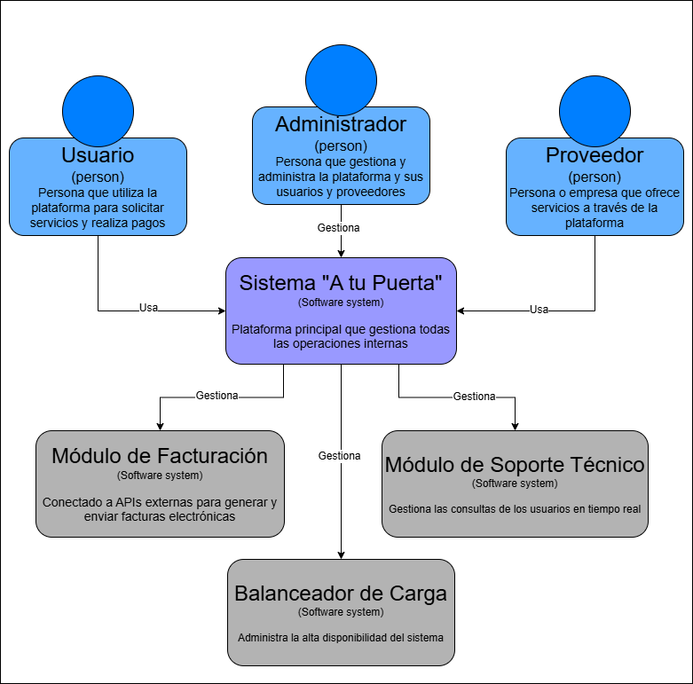

# 9.4. Iteración 3: Refinar estructuras para abordar el atributo de calidad más importante

### Paso 1: Revisar Entradas
**Propósito de Diseño**  
Refinar las estructuras para optimizar la disponibilidad y la interoperabilidad, centrándose en los módulos de facturación electrónica y soporte técnico.

- **Funcionalidad Primaria:**
  - UC-08: Generación de facturas electrónicas.
  - UC-09: Estado de pagos.
  - UC-10: Soporte técnico mediante contacto en vivo.

- **Escenarios de Calidad:**
  - QA-07: Interoperabilidad con sistemas para generación de facturas.
  - QA-09: Disponibilidad del soporte técnico 24/7.

- **Restricciones y Preocupaciones de Arquitectura:**
  - Integración exclusiva con servicios de facturación compatibles con Node.js (CON-06).
  - Alta disponibilidad del soporte técnico (CRN-06).

### Paso 2: Establecer objetivo de la iteración
Refinar las estructuras existentes para asegurar la disponibilidad continua y la integración eficiente con sistemas externos, priorizando la facturación electrónica y el soporte técnico.

### Paso 3: Elección de elementos del sistema a refinar

### Paso 4: Elección de conceptos de diseño que satisfacen el driver seleccionado
| Código | Decisión de Diseño                                             | Fundamentación                                                                                                    |
|--------|----------------------------------------------------------------|------------------------------------------------------------------------------------------------------------------|
| DEC-12  | Uso de APIs de facturación compatibles con Node.js.            | Facilita la integración eficiente y segura con sistemas externos (CON-06, QA-07).                                 |
| DEC-13  | Implementación de sistema de soporte técnico 24/7.             | Asegura disponibilidad continua, mejorando la experiencia del usuario (QA-09, CRN-06).                            |
| DEC-14 | Escalabilidad del sistema de soporte técnico.                  | Permite ajustar el sistema en función de la demanda, optimizando la disponibilidad (QA-09).                       |

### Paso 5: Instanciar elementos de arquitectura, asignar responsabilidades y definir interfaces
| Código | Elemento de Arquitectura          | Responsabilidad                                                                           | Interfaces Asociadas                                               |
|--------|-----------------------------------|-----------------------------------------------------------------------------------------|--------------------------------------------------------------------|
| DEC-15   | Módulo de Facturación Electrónica | Gestionar la creación y envío de facturas electrónicas.                                 | API para integración con servicios externos compatibles con Node.js.|
| DEC-16   | Módulo de Soporte Técnico         | Proporcionar asistencia técnica en tiempo real y gestionar la escalabilidad del sistema.| Chat en vivo mediante WebSockets, API REST para soporte.           |
| DEC-17   | Balanceador de Carga              | Garantizar la alta disponibilidad del sistema y distribuir las solicitudes entre servidores.| Interfaz con el servidor de aplicaciones y módulos internos.       |
| DEC-18   | Base de Datos Centralizada        | Almacenar datos relacionados con facturas, soporte técnico y disponibilidad del sistema.| CRUD para operaciones con MongoDB y soporte de transacciones.      |

### Paso 6: Bosquejar vistas y registrar decisiones de diseño

### Paso 7: Analizar el diseño actual, revisar objetivo de la iteración y logro del propósito de diseño
| Elemento                           | Estado                     | Decisión de Diseño |
|------------------------------------|----------------------------|--------------------|
| UC-08 (Facturación electrónica)    | Parcialmente abordado     | DEC-12, DEC-15       |
| UC-09 (Estado de pagos)            | Completamente abordado     | DEC-12, DEC-15       |
| UC-10 (Soporte técnico 24/7)       | Parcialmente abordado     | DEC-13, DEC-14, DEC-16|
| QA-07 (Interoperabilidad)          | Completamente abordado     | DEC-12, DEC-18       |
| QA-09 (Disponibilidad de soporte)  | Parcialmente abordado     | DEC-13, DEC-14, DEC-16|
| CRN-06 (Escalabilidad y disponibilidad) | Parcialmente abordado | DEC-14, DEC-17       |

---
