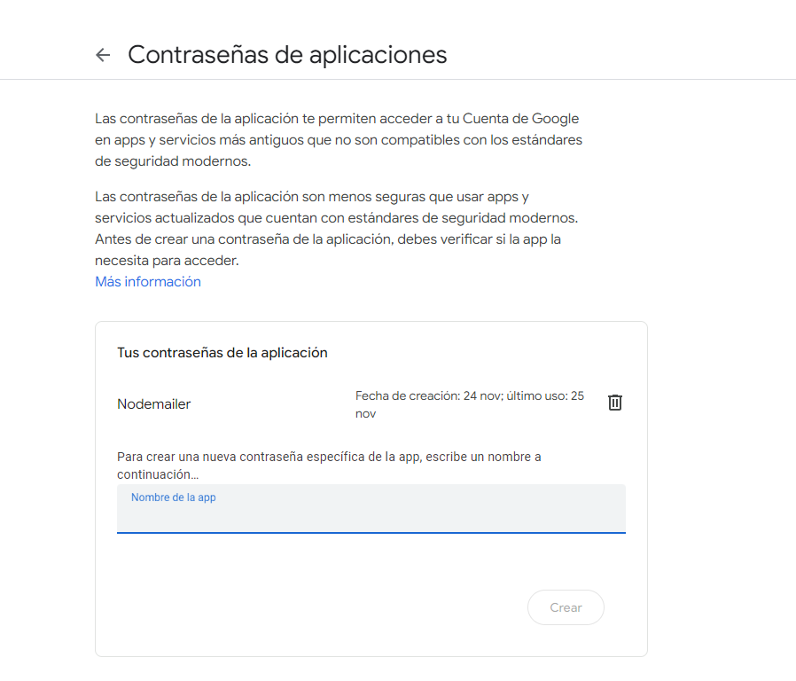

# Abraham Bustios

¿Cuál es mi experiencia en desarrollo de software?
Experienca en desarrollo de proyectos de curso en Java, C# y javascript. 

¿Qué tecnologías conozco o domino?

Conocimientos de ingenieria de Software y metologias ágiles.
NextJS 

¿Cuál es mi expectativa del curso?

Ampliar mis conocimientos en el área del desarrollo de software para adentrarme en el mundo laboral profesional.

¿Cómo me veo en 10 años? 

Como un desarrollador independiente y dueño de mi propio estudio de desarrollo de videojuegos.

## Tema elegido: API Management

### Desarrollo Conceptual

API management o gestión de API es el proceso mediante el cual las empresas pueden asegurarse de que sus Apis sean  consumibles, seguras y administradas . Esto se logra mediante herramientas de Api Management como Kong o APIGEE, entre sus multiples funciones encontraremos las 4 básicas y escenciales.

**Api Gateway** , un controlador de tráfico que guía las solicitudes de API entrantes a los microservicios de back-end adecuados. Comprueba si el cliente que realiza la solicitud tiene acceso verificando sus credenciales y permisos, al igual que un guardia de seguridad vigilante, ayuda con la transformación de solicitudes asegurándose de que los datos se intercambien en el formato correcto y por ultimo tambien de limitar la velocidad y monitorear el flujo del trafico.

**Portal de Desarrollador**, funciona como un hub para que los desarrolladores accedan a información sobre sus API y comprendan cómo integrarlas de manera óptima en sus aplicaciones , en este podran encontrar contenidos como documentación, ejemplos de código, tutoriales y otros recursos que puedan ayudar a los desarrolladores a trabajar con las distintas apis aún si trabajan en distintas áreas.

**Gestir de Ciclo de vida** , proceso en el que se documenta toda la información desde la planeación, diseño , testo , despliegue y retiro de las apis. Esto con la finalidad de salvaguardad la integridad de cualquiero servicio o negocio que dependa de ellas.

**Monitorización y Análisis**, conjunto de métricas y reportes a través de los cuales se puede registar la tasa de uso de todas las apis, el nivel de carga y registrar la información de los clientes que relizaron solicitudes. Además, es posible utilizar la información recopilada para diagnosticar problemas o errores en los servicios y tambien procesarla para su uso en la toma de decisiónes a nivel coporativo.

Realmente no hay razon para no implmenetar Api Management en una solución para una empresa o negocio, aspectos como el tener toda arquitectura de APIs centralizada junto con medidas de seguridad , monitoreo y analisis y documentación son muy atractivas. Los unicos aspectos que se deben de tener en cuenta y aceptar son los costos adicionales por la contratación del servicio, la dependencia con el proveedor , la curva de aprendizaje y el impacto en el rendimiento, los cuales pueden ser abrumadores para una mipe pero  para una mediana o gran empresa son más que aceptables.

### Consideraciones Técnicas:

La plataforma de API management en cuestión que utilizaremos en esta ocación es "Apigee", plataforma de API management de google cloud pque ofreec varias de las funciones mencionadas anteriormente. Antes de empezar es importante recalcar que al tratarse de una herramienta de google necesitaremos una cuenta de google para acceder a sus servicios cloud. Dicho servicio tiene un costo que varia en base al uso de sus distintas funcionalidad, pero afortunadamente google ofrece un crédito de 300$ para gastar en 90 dias cuando nos registramos por primera vez aunque claro de todas maneras tendremos que registrar una dirección de pago y una  tarjeta de debito/crédito. 

Despues de que el sistema valide nuestros datos nos enviará a la pantalla de inicio de Gogle Cloud, donde en el centro podremos observar nuestros créditos restantes y su fecha de caducidad

Luego buscamos Apigee en el buscador

Ahora nos encontraremos en el panel de control de Apigee, desde donde podremos acceder a todas las funcionalidades que ofrecen. Recalco de que la primera vez que se ingrese nos pedirá crear un entorno para registar nuestra apis. ( no puedo hacerlo de nuevo ya que no me deja registrar la misma tarjeta en otra cuenta)

Desde aquí se podran acceder a distintas funcionalidades de apigee, pero por fines de practicidad y tiempo probaremos la función de monitorización y analisis , para ello primero deberemos de crear un proxy que haga de intermediario entre el frontend y backend.  Para ello nos dirigimos a la barra lateral y accedemos a la sección de proxies de api.

Le damos a Create 

Ahora procedemos a hacer lo siguiente:

1. selecionamos el template de Reverse proxy.
2. Le asignamos un nombre al proxy para identificarlo.
3. Seteamos el basepath para el proxy a nuestro gusto (apigee generará uno por default con el mismo nombre que el del proxy)
4. Podemos ingresar una descripción para su mejor entendimiento por otros miembro del equipo.
5. Ingresamos la dirección de la API en el backend .
Y le damos a siguiente.

Ahora procedemos a seleccionar el entorno en donde planeamos desplegar el proxy.

Ahora teniendo el proxy desplegado ponemos probar a consultar el endopoint a través del proxy, para ello **necesitamos la URL del entorno en el que la desplegamos** por lo que nos dirigirémos a la barra lateral y descenderemos hasta encontrar la opción de "entornos" en el apartado de administración.

ahora nos dirigimos a la pestaña de Grupos de Entornos y encontraremos las URL's de los entornos creados.

Finalmente, podemos consultar directamente a la url mediante el navegador o una harramienta de testeo como postman.

## Patron Cloud a Implementar : Asynchronous Request-Reply

### ** Desarrollo Conceptual **

Hoy en dia las aplicaciones  que corren en navegadores hacen uso de multiples API's para ofrecer funcionalidad y entregar valor a las empresas y usuarios, las cuales pueden interactura solo con los elementos de sistema o tambien con otros externos de terceros. Estas consultas se hacen usualmente mediante el  protocolo HTTP y Rest, y aunque en al acutalidad la gran mayoria de estas apis están optimizadas para responder en 100ms o menos todavia hay muchos factores que pueden afectar la latencia en la respuesta, cómo por ejemplo:

- Componentes de seguridad.
- La ubicación geográfica relativa del autor de la llamada y el backend.
- Infraestructura de red.
- Carga actual.
- El tamaño de la carga útil de la solicitud.
- Longitud de la cola de procesamiento.
- El tiempo que tarda el backend en procesar la solicitud.

Si bien algunos de estos factores se pueden mitigar escalando y añandiendo mas recursos al backend todavia existen otros como la arquitectura de red, que están fuera de control del desarrollador. Pero aún así todavia existen escenarios en los que el procesamiento de la respuesta de una petición síncrona puede tardar demasiado como para responer en la misma conexión, para ello existe la posibilidad de hacer una petición asíncrona que parezca sincrona

### **Consideraciones Tecnicas:**

El problema que se logró identificar es que uno ed los pasos que los clientes y proveedores deben completar para registrarse es la validación del DNI o RUC por motivos de seguridad. Debido a que el registros consta de varios pasos y que la validadción puede demorar o dar algún error dependiendo de la API seria un problema detener el registro unicamente para validar los documentos de identidad cuando podrian validarse antes de enviar la conclusión del registro.
Mediante la implementación del patrón Asynchronous Request-Reply se espera que los usuarios puedan completar formulario de registro sin la necesidad de esperar a que su dni o RUC se valide meidiante la API de APIsPerú, cumpliendo así con la finalidad del patrón Asynchronous Request-Reply de permitir seguir haciendo uso de otras funciones de la aplicación hast aque se reciba la respuesta de la API.

La implementación de patrón se hace mediante lo que se conoce como polling en http.

1. El cliente envia una petición POST conteniendo la data necesarioa de entrada al endpoint  , el servidor recibe la petición y pone en cola el recurso solicitado a la vez envia una respuesta HTTP 200 (Aceptado) conteniendo una dirección a un endpoint al cual consultar por el estado del recurso al que se solicitó acceso.
2. El cliente envia una petición GET al endpoint de estado y recibe un HTTP 200 O 404 indicando que el recurso solicitado todavia no está listo.
3. El cliente envia nuevamente una petición GET al endoint de estado luego de un timpo determinado y el servidor envia un HTTP 302 (found) con la dirección de recurso solicitado .
4. Por ultimo el cliente envia una petición GET a la dirección brindada por el servidor para finalmente acceder al recurso solicitado.

###% **Desarrollo de código :**

** Variables Globales**

Variables indispensables para esta demo de patrón

 ** API validar DNI **

** API Estado validar **

## Patrón Arquitectura MicroKernel

**Desarrollo Conceptual :**

El estilo arquitectónico de Microkernel o también conocido como arquitectura de Plug-in, permite crear aplicaciones extensibles, mediante la cual es posible agregar nueva funcionalidad mediante la adición de pequeños plugins que extienden la funcionalidad inicial del sistema. En una arquitectura de Microkernel las aplicaciones se dividen en dos tipos de componentes, en sistema Core (o sistema central) y los plugins (o módulos), el sistema Core contiene los elementos mínimos para hacer que la aplicación funcione y cumpla el propósito para el cual fue diseñada, por otra parte, los módulos o plugins con componentes periféricos que se añaden o instalan al componente Core para extender su funcionalidad. O sea que solo puede haber un componente Core y muchos Plugins.

La idea central de este estilo arquitectónico es permitir la extensión de su funcionalidad o personalización, pero respetando el principio Open-Closed, es decir, está abierto para extender la funcionalidad, pero cerrado para modificar su funcionalidad principal. De esta forma, se logra que los desarrolladores pueden crear plugins para agregar nueva funcionalidad o extender la existente, pero sin alterar la funcionalidad Core del sistema

#### Ventajas

  - Escalabilidad: El patrón permite agregar funcionalidades adicionales a traves de módulos o plugins sin modificar el nucleo del sistema, al tomar este enfoque de arquitectura en vez de implementar multiples funcionalidades junto con el nucleo base se logra reducir el acoplamiento.

**Consideraciones tecnicas :**

El plugin que se desea agregar al sistema base (core) es el de Nodemailer, un plugin que mediante sus propioas librerias que permite enviar correos electronicos incluyendo el destintatario, asunto, mensaje e inclusive permite ingresar HTML con estilos , es importante recalcar que Nodemailer no nos proporciona con un correo desde el cual enviar los correos, para ello nosotros tendremos que utilizar nuestro propio correo y realizar una serie de configuraciones previas .(Por motivos practicos se utilizará un correo de google). Si seguimos las indicaciones en su propia web (https://www.nodemailer.com) para hacer uso de plugin nos encontramos con los siguientes pasos.

### 1. Instalamos las librerias en el proyecto

### 2. Creamos un sendmail.JS para la ruta en el backend
Creamos el archivo y copiamos y  el código que nos indica la pagina de https://www.nodemailer.com , sin antes importar las librerias que se han utilizado para manejar los endpoints del backend. (En este caso se utilzó router. para manejar las peticiones. 

#### Y no olvidamos de agregar el sendmail.js al index del backend

### 3. Seteo de credenciales y configuración de correo
A continuación definimos las siguientes variables dentro de un  .env en el backend para poder almacenar el correo y contraseña de la dirección de correo que se planea utilizar, importante dejar el campo de la contraseña vacio, pues luego definiremos   una contraseña especial para aplicaciones que nos propocionará google

#### Activamos verificación de 2 pasos
Para poder generar una contraseña de aplicación para una cuenta de google es necesario activar primero la verificación de 2 pasos en el apartado de seguridad de la cuenta de google, para ello ocuparemos de un correo o número de telefono que sirva como autenticador adicional.

#### Generar contraseña de aplicación
Luego de haber activado la verificación de 2 pasos ingresamos al siguiente enlace https://myaccount.google.com/u/5/apppasswords?rapt=AEjHL4OhXd0DaCXS7CjMGYZewDnFaRYZhcdZNGlF5_HlRx4o5Q3f5COtnudTolOAf5_Bt7W_FrIwpHLg0HkaCGmbYTEP97T-QyFI8yN9p-5tevqO_WazmzQ .

Ahora definimos el nombre de la aplicación para la que se va a generar la clave de aplicación y le damos a crear 

Una vez generada la clave podemos ingresarla en la variable EMAIL_PASSWORD en el .env visto al inicio del paso

(ES DE SUMA IMPORTANCIA PROTEGER ESTA CLAVE YA QUE ES LA QUE PERMITE A CUALQUIER APLICACIÓN ENVIAR CORREOS EN NUESTRO NOMBRE)

### 4. Prueba
Por ultimo ejecutamos el backend y realizamos una petición de tipo POST al endpoint http://localhost:3009/sendmail e incluimos en su body los siguientes valores

utilizamos postman para hacer a prueba 

Y recibimos el correo exitosamente

## Demo Video de los 3 patrones 

[https://drive.google.com/file/d/1v4ayTE6-QU_Esuu5Ul7mewtyg0cLE0gO/view?usp=sharing](https://drive.google.com/drive/folders/1yaHlqfyRdgm84EJdeL0gxjkLpfTkPhfX?usp=sharing)

[Regresar al índice](../../README.md)
