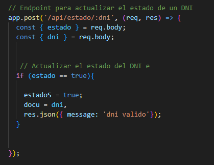

# Abraham Bustios

¿Cuál es mi experiencia en desarrollo de software?
Experienca en desarrollo de proyectos de curso en Java, C# y javascript. 

¿Qué tecnologías conozco o domino?

Conocimientos de ingenieria de Software y metologias ágiles.
NextJS 

¿Cuál es mi expectativa del curso?

Ampliar mis conocimientos en el área del desarrollo de software para adentrarme en el mundo laboral profesional.

¿Cómo me veo en 10 años? 

Como un desarrollador independiente y dueño de mi propio estudio de desarrollo de videojuegos.

## Tema elegido: API Management

### Desarrollo Conceptual
API management o gestión de API es el proceso de diseño, publicación, documentación y análisis de API, en un entorno seguro. Mediante una herramienta de administración de API, se puede garantizar que tanto APIs públicas como internas funcionen correctamente y sean seguras. Puedes controlar el acceso, nutrir a la comunidad de suscriptores, recopilar y analizar estadísticas de uso e informar sobre el rendimiento.

Usualmente, los componentes de API management, proporcionan mecanismos y herramientas para ayudar a la comunidad de desarrolladores y suscriptores.

#### Diseño de API: es decir, brinda a los usuarios, desde desarrolladores hasta socios, la capacidad de diseñar, publicar e implementar una API, así como registrar documentación, políticas de seguridad, descripciones, límites de uso, capacidad de tiempo de ejecución, entre otra información relevante.

#### Puerta de enlace de API: 
funciona como un filtro de todas las APIs al hacer cumplir las políticas y solicitudes de seguridad de las APIs relevantes y también garantiza la autorización y la seguridad. 

#### Tienda de APIs: 
brinda a los usuarios la capacidad de mantener sus APIs en una tienda o catálogo donde pueden exponerlas a posibles interesados. Además, los usuarios pueden obtener soporte de los usuarios y la comunidad, etc. 

#### Análisis de API: 
la gestión de APIs permite a los usuarios monitorear el uso del API, la carga, los registros, las transacciones, los datos históricos, entre otras métricas que informan mejor el estado y el éxito de las APIs disponibles.

#### Monetización: 
esta función permite el cobro por el acceso a APIs comerciales. Esto incluye el soporte para configurar reglas de precios, según el uso, la carga y la funcionalidad, emitir facturas y cobrar pagos.

### Consideraciones Técnicas:

La plataforma de API management en cuestión es "Apigee", plataforma de API management de google. Para este proyecto usaremos APIGEE para establecer un proxy entre el frontend y backend .

Para ello es necesario 

## Patron Cloud a Implementar : Asynchronous Request-Reply

### **Problema :**

Hoy en dia las aplicaciones  que corren en navegadores  hacen uso de multiples API's para ofrecer funcionalidad y valor a las empresas y usuarios. Estas usualmente se hacen mediante llamadas en el protocolo HTTP y Rest, y aunque en al acutalidad la gra mayoria de estas apis están optimizadas para responder en 100ms o menos todavia hay muchos factores que pueden afectar la latencia en la respuesta, cómo por ejemplo:

- Componentes de seguridad.
- La ubicación geográfica relativa del autor de la llamada y el backend.
- Infraestructura de red.
- Carga actual.
- El tamaño de la carga útil de la solicitud.
- Longitud de la cola de procesamiento.
- El tiempo que tarda el backend en procesar la solicitud.

Esto se refuerza aún más cuando de peticiones sincronas se tratan, aunque si bien se podria optar por peticiones asíncronas simples que se maneje en la misma sesión no podria ser viable para sistemas disbribuidos o con mulitples servicios.

### **Solución:**

1. El cliente envia una petición POST conteniendo la data necesarioa de entrada al endpoint  , el servidor recibe la petición y pone en cola el recurso solicitado a la vez envia una respuesta HTTP 200 (Aceptado) conteniendo una dirección a un endpoint al cual consultar por el estado del recurso al que se solicitó acceso.
2. El cliente envia una petición GET al endpoint de estado y recibe un HTTP 200 O 404 indicando que el recurso solicitado todavia no está listo.
3. El cliente envia nuevamente una petición GET al endoint de estado luego de un timpo determinado y el servidor envia un HTTP 302 (found) con la dirección de recurso solicitado .
4. Por ultimo el cliente envia una petición GET a la dirección brindada por el servidor para finalmente acceder al recurso solicitado.

### **Casos de aplcación :**

### **Aplicación en el trabajo de Grupo :**

El problema que se logró identificar es que uno ed los pasos que los clientes y proveedores deben completar para registrarse es la validación del DNI o RUC por motivos de seguridad. Debido a que el registros consta de varios pasos y que la validadción puede demorar o dar algún error dependiendo de la API seria un problema detener el registro unicamente para validar los documentos de identidad cuando podrian validarse antes de enviar la conclusión del registro.
Mediante la implementación del patrón Asynchronous Request-Reply se espera que los usuarios puedan completar formulario de registro sin la necesidad de esperar a que su dni o RUC se valide meidiante la API de APIsPerú, cumpliendo así con la finalidad del patrón Asynchronous Request-Reply de permitir seguir haciendo uso de otras funciones de la aplicación hast aque se reciba la respuesta de la API.

### **Desarrollo de código :**

#### ** Variables Globales**

####  ** API validar DNI**

####  ** API Estado validar GET**

####  ** API Estado validar POST**

####  ** Variables Globales**

## Patrón Arquitectura MicroKernel

**Desarrollo Conceptual :**

El estilo arquitectónico de Microkernel o también conocido como arquitectura de Plug-in, permite crear aplicaciones extensibles, mediante la cual es posible agregar nueva funcionalidad mediante la adición de pequeños plugins que extienden la funcionalidad inicial del sistema. En una arquitectura de Microkernel las aplicaciones se dividen en dos tipos de componentes, en sistema Core (o sistema central) y los plugins (o módulos), el sistema Core contiene los elementos mínimos para hacer que la aplicación funcione y cumpla el propósito para el cual fue diseñada, por otra parte, los módulos o plugins con componentes periféricos que se añaden o instalan al componente Core para extender su funcionalidad. O sea que solo puede haber un componente Core y muchos Plugins.

La idea central de este estilo arquitectónico es permitir la extensión de su funcionalidad o personalización, pero respetando el principio Open-Closed, es decir, está abierto para extender la funcionalidad, pero cerrado para modificar su funcionalidad principal. De esta forma, se logra que los desarrolladores pueden crear plugins para agregar nueva funcionalidad o extender la existente, pero sin alterar la funcionalidad Core del sistema

**Consideraciones tecnicas :**

El plugin que se desea agregar al sistema base (core) es el de Nodemailer, un plugin que mediante sus propioas librerias que permite enviar correos electronicos desde código. Si seguimos las indicaciones en su propia web (https://www.nodemailer.com) para hacer uso de plugin nos encontramos con los siguientes pasos.

#### Instalamos las librerias en el proyecto

#### Creamos un archivo.JS para la ruta en el backend
Creamos el archivo y copiamos y  el código que nos indica la pagina de https://www.nodemailer.com , sin antes importar las librerias que se han utilizado para manejar los endpoints del backend. (En este caso se utilzó router. para manejar las peticiones. 

## Demo Video

https://drive.google.com/file/d/1v4ayTE6-QU_Esuu5Ul7mewtyg0cLE0gO/view?usp=sharing

[Regresar al índice](../../README.md)
