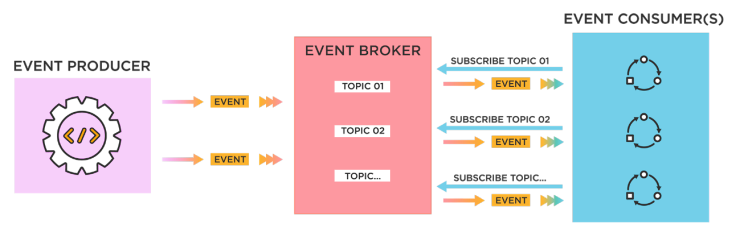

# Integrante: Mario Alexander Cartolin Yanque

Soy Mario Alexander Cartolin Yanque, estudiante de noveno ciclo en la carrera de Ingeniería de Sistemas. Tengo experiencia intermedia en desarrollo de software a través de proyectos académicos, principalmente en lenguajes como C++, Python, Java, y JavaScript, además de frameworks como React. Aunque no tengo mucho conocimiento sobre la arquitectura de software, sé que esta área es crucial para diseñar sistemas robustos y escalables. Espero que el curso me ayude a entender cómo aplicar principios de arquitectura para mejorar la eficiencia y mantenimiento de los proyectos que desarrolle en el futuro. En 10 años, me imagino trabajando como ingeniero de software en una empresa innovadora, desarrollando soluciones que impacten positivamente en la sociedad.

# Trabajo Individual: Arquitectura Basada en Eventos

## Introducción

La **Arquitectura Basada en Eventos** (EBA, por sus siglas en inglés) es un paradigma de diseño ampliamente utilizado en sistemas distribuidos modernos que requieren alta escalabilidad, flexibilidad y capacidad de procesamiento en tiempo real. A través de este enfoque, los componentes del sistema están diseñados para reaccionar a los **eventos** que representan cambios de estado o actividades de interés. Esta arquitectura permite a las aplicaciones reaccionar a las condiciones de su entorno de manera casi instantánea, lo que es crucial para los sistemas que gestionan grandes volúmenes de datos o requieren respuestas inmediatas.

---

## ¿Qué es la Arquitectura Basada en Eventos?

La arquitectura basada en eventos se centra en la creación, detección y consumo de eventos como un mecanismo de comunicación entre los componentes de un sistema. Un **evento** es cualquier ocurrencia significativa que puede ser detectada por el sistema. Los componentes en este tipo de arquitectura no están directamente conectados entre sí, sino que se comunican a través de la generación y captura de eventos. 

En lugar de depender de la tradicional interacción sincrónica entre componentes (como las llamadas directas), los eventos permiten un **desacoplamiento temporal** entre productor y consumidor. Esto es posible porque los eventos se transmiten a través de **canales** que actúan como intermediarios, permitiendo que los consumidores reciban los eventos cuando estén disponibles para procesarlos.

---

## Componentes Clave

### **Productor (Producer)**

El **Productor** es el componente responsable de detectar cambios o eventos dentro del sistema y emitirlos para ser consumidos. Los eventos pueden ser generados en respuesta a una acción del usuario, una modificación de datos, un cambio en el sistema o una condición externa.

- **Rol y Funciones**:
  - **Detección de eventos**: El productor detecta que ha ocurrido una acción o evento de interés en el sistema.
  - **Creación de eventos**: Luego de la detección, el productor crea un evento que representa este cambio. Este evento contiene información relevante sobre la acción.
  - **Publicación de eventos**: El productor publica este evento a través de un **canal de eventos**, donde estará disponible para ser consumido por uno o varios consumidores.

- **Ejemplos**:
  - Un sistema de comercio electrónico genera un evento cada vez que un cliente realiza una compra, proporcionando detalles como el producto comprado, la cantidad y el usuario.
  - Un sistema de monitoreo de sensores puede generar eventos cuando la temperatura de un sensor excede un umbral determinado.

### **Consumidor (Consumer)**

El **Consumidor** es el componente que escucha y reacciona a los eventos emitidos por uno o varios productores. A diferencia del productor, que solo genera eventos, el consumidor está diseñado para recibir estos eventos y ejecutar las acciones correspondientes, como actualizar bases de datos, iniciar procesos adicionales o notificar a otros sistemas.

- **Rol y Funciones**:
  - **Suscripción**: El consumidor se suscribe a uno o más canales de eventos para recibir actualizaciones de interés.
  - **Procesamiento de eventos**: Una vez que recibe un evento, el consumidor realiza una acción en función del contenido del evento. Este procesamiento puede variar desde actualizar registros hasta iniciar procesos complejos de negocio.
  - **Reacción**: Después de procesar un evento, el consumidor puede generar nuevos eventos en respuesta, los cuales a su vez pueden ser consumidos por otros componentes.

- **Ejemplos**:
  - Un sistema de inventario que, al recibir un evento de compra, reduce la cantidad disponible del producto en cuestión.
  - Un servicio de notificaciones que envía un correo electrónico al cliente una vez que su pedido ha sido confirmado.

### **Canales de Eventos (Event Brokers)**

Los **Canales de Eventos** son la infraestructura que permite que los productores y los consumidores intercambien información sin depender directamente uno del otro. Estos canales pueden tomar la forma de colas, temas o flujos de datos en tiempo real, y su elección depende de las necesidades del sistema en términos de rendimiento y fiabilidad.

- **Características de los Canales**:
  - **Desacoplamiento temporal**: Los productores y consumidores no necesitan estar activos al mismo tiempo. Los eventos pueden ser almacenados en el canal hasta que los consumidores estén listos para procesarlos.
  - **Escalabilidad**: Los canales permiten manejar grandes volúmenes de eventos de manera eficiente, distribuyendo la carga entre múltiples consumidores si es necesario.
  - **Fiabilidad**: Los canales de eventos pueden implementar mecanismos como confirmaciones de recepción, reintentos automáticos y particionamiento de eventos para garantizar que ningún evento se pierda.

- **Tipos de Canales**:

  | Tipo                | Descripción                                                                                       |
  |---------------------|---------------------------------------------------------------------------------------------------|
  | **Colas (Queues)**  | Los eventos son almacenados en una cola y procesados por un solo consumidor en orden FIFO (First In, First Out). Ideal para tareas secuenciales. |
  | **Temas (Topics)**  | Los eventos son publicados en un tema al que múltiples consumidores pueden suscribirse. Esto permite que varios servicios respondan al mismo evento. |
  | **Streams**         | Los eventos son transmitidos como un flujo continuo de datos, donde pueden ser procesados en tiempo real o almacenados para procesamiento posterior. |

*Figura 1: Relación entre Productor, Consumidor y Canal de Eventos.*

---

## Tipos de Procesamiento de Eventos

El procesamiento de eventos en una arquitectura basada en eventos puede dividirse en dos categorías:

1. **Procesamiento en Tiempo Real**: Los eventos se procesan inmediatamente después de su emisión, lo que es fundamental para sistemas que requieren respuestas inmediatas, como los sistemas financieros o aplicaciones IoT. 
2. **Procesamiento Diferido**: Los eventos se acumulan y procesan de manera conjunta en intervalos regulares. Esto es útil cuando el procesamiento no necesita ser inmediato, como en la generación de informes.

---

## Ventajas y Desventajas

### Ventajas

- **Desacoplamiento**: Los productores y consumidores están separados, lo que permite que los componentes evolucionen de manera independiente. Esto facilita la modificación y el mantenimiento del sistema sin causar interrupciones.
- **Escalabilidad**: Los consumidores pueden ser escalados horizontalmente para manejar grandes cantidades de eventos, mejorando el rendimiento del sistema.
- **Reactividad en tiempo real**: La capacidad de responder rápidamente a eventos hace que los sistemas basados en eventos sean ideales para aplicaciones críticas en tiempo real.
- **Tolerancia a fallos**: Los eventos pueden ser almacenados en canales hasta que los consumidores estén listos o disponibles, lo que aumenta la fiabilidad del sistema.

### Desventajas

- **Complejidad**: Implementar una arquitectura basada en eventos introduce nuevos desafíos en cuanto a la gestión de eventos, monitoreo y trazabilidad. Además, puede ser difícil depurar el flujo de eventos en sistemas grandes y distribuidos.
- **Consistencia eventual**: Dado que los eventos pueden no ser procesados inmediatamente, existe una posible inconsistencia temporal en el sistema.
- **Costes de infraestructura**: El uso de canales de eventos como Kafka o RabbitMQ puede incrementar los costes en términos de infraestructura y mantenimiento.

---

## Casos de Uso

- **Sistemas de Comercio Electrónico**: Cuando un usuario realiza una compra, el sistema genera eventos que activan acciones en múltiples componentes, como la actualización del inventario, la confirmación del pedido y el envío de una notificación al cliente.
- **IoT (Internet de las Cosas)**: En entornos de IoT, los dispositivos conectados emiten constantemente eventos que pueden ser procesados para tomar decisiones en tiempo real, como activar una alarma cuando un sensor detecta movimiento.
- **Finanzas**: El procesamiento de transacciones financieras o la detección de fraudes son áreas clave donde la arquitectura basada en eventos proporciona beneficios al permitir una respuesta rápida a las acciones del usuario o condiciones sospechosas.
- **Monitorización de Infraestructura**: Los sistemas de monitoreo pueden emitir eventos en función del estado de servidores, redes o bases de datos, y reaccionar en tiempo real a fallos o degradaciones.

---

## Consideraciones de Diseño

Al diseñar un sistema basado en eventos, es importante tener en cuenta:

1. **Selección de Herramientas**: Debes elegir la plataforma adecuada para manejar tus eventos, como Kafka, RabbitMQ o servicios en la nube como AWS SNS/SQS. Cada uno tiene diferentes ventajas en términos de rendimiento, fiabilidad y escalabilidad.
2. **Diseño de Eventos**: Los eventos deben ser ricos en información relevante pero compactos para minimizar la sobrecarga de procesamiento y transmisión.
3. **Monitoreo y Trazabilidad**: Es crucial implementar un sistema de monitoreo para rastrear los eventos a medida que se propagan por el sistema y poder detectar cuellos de botella o fallos.
4. **Consistencia Eventual**: En sistemas distribuidos, debes estar preparado para manejar la consistencia eventual y la posibilidad de que los consumidores reciban eventos con cierto retraso.

---

## Conclusión

La Arquitectura Basada en Eventos es una solución eficiente y flexible para sistemas que requieren procesamiento en tiempo real, alta escalabilidad y tolerancia a fallos. Su capacidad para desacoplar los componentes del sistema mediante el uso de eventos como mecanismo de comunicación es esencial para la construcción de aplicaciones modernas. Sin embargo, la implementación exitosa de este paradigma requiere una cuidadosa planificación en la elección de herramientas, el diseño de eventos y la gestión de la infraestructura subyacente.

[Regresar al índice](../../README.md)
