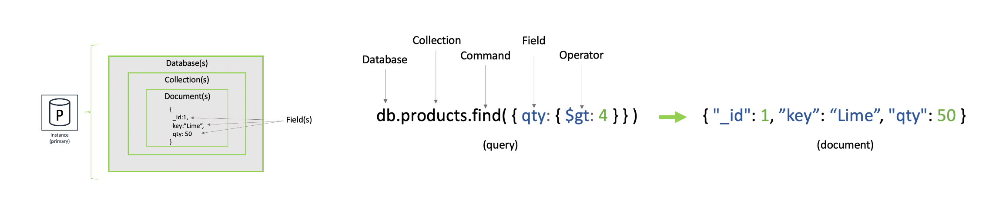
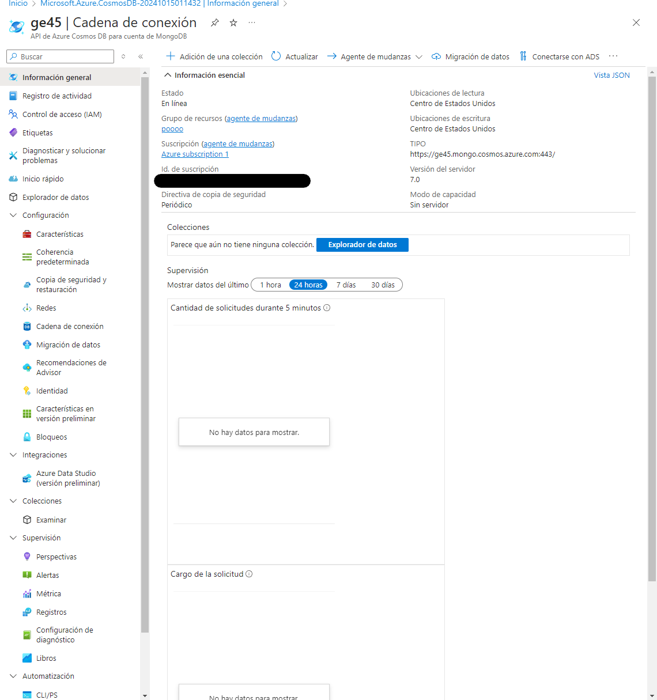

# George Zuñiga

### Experiencia:
Cuento con experiencia en codigo de bajo nivel ,ademas de herramientas digitales aplicadas a la realidad virtual , y con desarrollo en antiguos proyectos experimentales para sitios web. 
### Tecnologías:
- Java
- Python
- Javascript
- C#
- C++
- Rstudio
### Expectativa
Aplicar mi conocimiento aprendido a diferentes usos , ademas de tener diferentes medios de perspectiva en el area de la arquitectura de software.
### De aquí a 10 años
- Desarrollar mi sueño de aplicar mis conocimientos a mayor profundidad en el desarrollo de la realidad virtual

----------------------------------------------------------------------------------------------------------------------------

## **TEMA ELEGIDO**:  NoSQL - Bases de Datos Orientadas a Documentos
Las bases de datos de documentos son una categoría de sistemas NoSQL que permiten almacenar y consultar datos en formatos como JSON. Este formato, conocido como Notación de Objetos de JavaScript (JSON), es un medio de intercambio de datos que resulta fácil de leer tanto para umanos como para máquinas. Los desarrolladores pueden utilizar documentos JSON en su código y guardarlos de forma directa en una base 
de datos de documentos. Su naturaleza flexible, semi-estructurada y jerárquica facilita la evolución de las aplicaciones de acuerdo a sus necesidades.

### Bases de datos de documentos JSON
1. **Facilidad de desarrollo**:
Los documentos JSON se alinean estrechamente con los objetos, un tipo de dato común en la mayoría de lenguajes de programación. Durante el desarrollo de aplicaciones, los programadores pueden crear y actualizar documentos de forma directa desde su código, eliminando la necesidad de definir modelos de datos previamente, lo que hace que el desarrollo sea más ágil.
2. **Esquema flexible**:Una base de datos orientada a documentos permite tener distintos tipos de documentos con diferentes estructuras dentro de la misma colección. Esto es útil para almacenar datos no estructurados, como correos electrónicos o publicaciones en redes sociales. Algunas bases de datos incluso permiten aplicar validaciones de esquema para imponer restricciones a la estructura.
3. **Rendimiento a escala**:Las bases de datos de documentos pueden escalar horizontalmente sobre múltiples servidores sin afectar el rendimiento, lo que resulta en una solución rentable. También soportan la replicación integrada, lo cual mejora la tolerancia a fallos y la disponibilidad.
### Casos de uso
Las bases de datos de documentos son adecuadas para escenarios como 
gestión de contenido, catálogos de productos y gestión de datos de 
sensores, donde cada documento es único y puede evolucionar a lo largo 
del tiempo. 
1. **Administración de contenido**:I
deal para aplicaciones como blogs y plataformas de video, donde cada entidad puede ser almacenada como un único documento. Si el modelo de datos cambia, solo se actualizan los documentos afectados sin la necesidad de modificar esquemas.
2. **Comercio**: En el comercio electrónico, donde los productos pueden tener diferentes atributos, las bases de datos de documentos permiten almacenar cada producto en un solo documento, lo que facilita su gestión y mejora el rendimiento de las consultas.
3. **Sensores**:En aplicaciones IoT, los datos de los sensores son variables y pueden llegar incompletos o duplicados. Las bases de datos de documentos son ideales para almacenar estos datos de manera rápida y flexible, sin necesidad de limpiarlos de antemano.
### Cómo funcionan
Estas bases de datos almacenan la información en pares clave-valor, donde la clave es una cadena de texto y el valor puede ser cualquier tipo de dato (número, booleano, etc.). Además, permiten trabajar con matrices y objetos anidados, lo que facilita la representación de estructuras de datos complejas.

## **BASE DE DATOS ELEGIDA : cosmoDB**
Azure Cosmos DB es una base de datos NoSQL de Microsoft, diseñada para ofrecer alta disponibilidad y escalabilidad global. Soporta múltiples modelos de datos como JSON, claves-valor y grafos. Su arquitectura distribuida permite replicar datos en varias regiones, garantizando baja latencia y acceso rápido a nivel mundial.
### Ventajas:
1. Replicación Global: Datos replicados en varias regiones para acceso rápido y alta disponibilidad.
2. Escalabilidad: Ajuste automático de almacenamiento y rendimiento según demanda.
3. Modelos de Consistencia: Ofrece cinco niveles de consistencia para balancear latencia y precisión de los datos.
### Desventajas:
1. Costo Elevado: Puede ser caro con muchas réplicas o alto tráfico.
2. Relaciones Complejas: No es ideal para aplicaciones con múltiples relaciones entre datos, como bases de datos SQL.

## INICIACION DE LA BD
ABRIR LA BD DE COSMODB MEDIANTE UN NAVEGADOR
### 1er paso : Ir al portal de AZURE , inciar sesion con una cuenta e ingresar a CosmoDB.

### 2do paso : Crear la BD

### 3er paso : Construir el codigo y Ejecutarlo
1. Descargar los recursos MAVEN 
**https://maven.apache.org/download.cgi**

2. Crear un proyecto Maven 
Ejecutar el siguiente codigo en la terminal de VSCODE para crear un archivo MAVEN:

---------------
**mvn archetype:generate -DgroupId=com.ejemplo.cosmosdb -DartifactId=CosmosDBExample -DarchetypeArtifactId=maven-archetype-quickstart -DinteractiveMode=false**

--------------

3. Modificar las dependencias actuales por
**<dependencies>
    <dependency>
        <groupId>org.mongodb</groupId>
        <artifactId>mongo-java-driver</artifactId>
        <version>3.12.10</version>
    </dependency>
</dependencies>**

4. Estructurar el Codigo en VSCODE con la cadena de CONEXION PRINCIPAL que azure te proporciona

5. Instalar las dependencias necesarias

6. Ejecutar el codigo

# ENLACE DEL VIDEO :
### https://drive.google.com/file/d/1xSZsN9KD-ypYWFEx6YlAGP5Ns1hzhukX/view?usp=sharing

[Regresar al índice](../../README.md)
